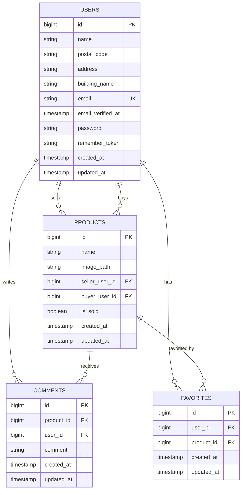

## 環境構築

### 前提条件

- Docker
- Docker Compose

### 初期設定手順

以下のコマンドは、この README があるディレクトリ（`src`）で実行してください。

1. **コンテナのビルドと起動**

```sh
docker-compose up -d --build
```

2. **PHPコンテナに入る**

```sh
docker-compose exec php bash
```

3. **Composerの依存関係をインストール**

```sh
composer install
```

4. **.envファイルの設定**

プロジェクトルートにある `.env.example` をコピーして `.env` を作成します：

```sh
cp .env.example .env
```

以下の環境変数を設定してください：

```
DB_CONNECTION=mysql
DB_HOST=mysql
DB_PORT=3306
DB_DATABASE=laravel_db
DB_USERNAME=laravel_user
DB_PASSWORD=laravel_pass
```

5. **アプリケーションキーの生成**

```sh
php artisan key:generate
```

6. **データベースのマイグレーション**

```sh
php artisan migrate
```

7. **データベースのシーディング**

```sh
php artisan db:seed
```

### 動作確認

- **アプリケーション**: http://localhost
- **phpMyAdmin**: http://localhost:8080
    - ユーザー: `laravel_user`
    - パスワード: `laravel_pass`
- **MailHog**: http://localhost:8025

## 画面URL一覧

ベースURLは `http://localhost` です。

### 認証不要でアクセス可能

- トップページ: `/`
- ログイン画面: `/login`
- 会員登録画面: `/register`
- 商品一覧画面: `/products`
- 商品詳細画面: `/products/{product}`（例: `/products/1`）
- セットアップ導線: `/setup`

### ログイン後にアクセス可能

- 商品出品画面: `/products/create`
- 購入画面: `/products/{product}/purchase`（例: `/products/1/purchase`）
- 送付先変更画面: `/products/{product}/purchase/destination`
- コンビニ支払い案内画面: `/products/{product}/purchase/konbini-pending?session_id={CHECKOUT_SESSION_ID}`
- プロフィール設定画面: `/profile/setup`
- プロフィール画面: `/profile`

### メール認証関連

- 認証メール案内画面: `/email/verify`
- 認証リンク受け口: `/email/verify/{id}/{hash}`

## meilhog（MailHog）について

この開発環境では、メール送信の確認に MailHog を使用しています。

### できること

- アプリから送信されたメールをブラウザで確認できる
- 実際のメールアドレスへは配信されない（ローカル開発用）

### 確認方法

1. アプリでメール送信処理を実行する（例: 会員登録、確認メール再送など）
2. http://localhost:8025 を開く
3. 受信一覧から対象メールを選択し、件名・本文・ヘッダーを確認する

### Laravel側の設定例

`.env` に以下を設定してください。

```
MAIL_MAILER=smtp
MAIL_HOST=mailhog
MAIL_PORT=1025
MAIL_USERNAME=null
MAIL_PASSWORD=null
MAIL_ENCRYPTION=null
MAIL_FROM_ADDRESS="hello@example.com"
MAIL_FROM_NAME="${APP_NAME}"
```

## Stripe決済について

このアプリでは、商品購入時に Stripe Checkout を使った決済を行います。

### 利用できる支払い方法

- カード決済
- コンビニ支払い

### 必要な環境変数

`.env` に以下を設定してください。

```
STRIPE_KEY=
STRIPE_SECRET=
STRIPE_WEBHOOK_SECRET=
```

### 補足

- コンビニ支払いは 120円 から 300,000円 の範囲で利用できます。
- Stripe の Webhook は `/stripe/webhook` で受けています。
- 決済完了後は、支払い方法に応じて購入結果の画面へ遷移します。

### 購入するボタン押下後のデバッグ処理

購入画面で「購入する」をクリックした後に不具合調査する場合は、以下の順で確認してください。

1. ブラウザの遷移先を確認する

- 正常時は Stripe Checkout へリダイレクトされます。
- 同一商品を他ユーザーが先に購入手続き中の場合は、購入画面へ戻されてエラーメッセージが表示されます。

2. Laravelログを確認する

```sh
docker-compose exec php tail -f storage/logs/laravel.log
```

- Stripe接続失敗時は `Stripe checkout session create failed.` が出力されます。
- 想定外エラー時は `Checkout session create unexpected failure.` が出力されます。

3. 商品の売約状態をDBで確認する

```sql
SELECT id, is_sold, buyer_user_id, seller_user_id
FROM products
WHERE id = 対象商品ID;
```

- `is_sold = 1` かつ `buyer_user_id` が入っている場合は、購入手続き中または購入済みです。
- 決済失敗時に売約が解除されない場合は、ログの例外発生タイミングを確認してください。

4. Stripeダッシュボードで Checkout Session を確認する

- Metadata の `product_id` と `buyer_user_id` が、対象商品・ログインユーザーと一致しているか確認します。
- コンビニ支払いの場合は支払いステータスが反映されるまで時間差があるため、Webhook受信有無も合わせて確認します。

5. Webhook受信テスト（必要時）

```sh
stripe listen --forward-to http://localhost/stripe/webhook
```

- テストイベント送信後、`/stripe/webhook` が 200 を返すことを確認してください。

## データベース設計

### ER図（Mermaid）

以下は Mermaid によるER図です。GitHub上、またはVS CodeのMarkdownプレビューで図として表示されます。

- VS Code: `Markdown: Open Preview` を実行



### テーブル説明

- **users**: ユーザー情報（出品者・購入者）
- **products**: 商品情報（seller_user_id：出品者、buyer_user_id：購入者）
- **comments**: 商品に対するコメント
- **favorites**: ユーザーのお気に入り商品管理（user_id, product_idの組み合わせはユニーク）

## 商品削除方法

特定の商品を削除したい場合は、以下のエンドポイントにPOSTリクエストを送信してください（要ログイン）。

- エンドポイント: `/products/{id}/delete`
- メソッド: POST

例：curlコマンド

```sh
curl -X POST http://localhost/products/31/delete --cookie "your_session_cookie"
```

BladeやJSからフォームで：

```html
<form method="POST" action="/products/31/delete">
    @csrf
    <button type="submit">削除</button>
</form>
```

これで商品ID 31が削除されます。

<p align="center"><a href="https://laravel.com" target="_blank"></a></p>

<p align="center">
<a href="https://travis-ci.org/laravel/framework"></a>
<a href="https://packagist.org/packages/laravel/framework"></a>
<a href="https://packagist.org/packages/laravel/framework"></a>
<a href="https://packagist.org/packages/laravel/framework"></a>
</p>

## About Laravel

Laravel is a web application framework with expressive, elegant syntax. We believe development must be an enjoyable and creative experience to be truly fulfilling. Laravel takes the pain out of development by easing common tasks used in many web projects, such as:

- [Simple, fast routing engine](https://laravel.com/docs/routing).
- [Powerful dependency injection container](https://laravel.com/docs/container).
- Multiple back-ends for [session](https://laravel.com/docs/session) and [cache](https://laravel.com/docs/cache) storage.
- Expressive, intuitive [database ORM](https://laravel.com/docs/eloquent).
- Database agnostic [schema migrations](https://laravel.com/docs/migrations).
- [Robust background job processing](https://laravel.com/docs/queues).
- [Real-time event broadcasting](https://laravel.com/docs/broadcasting).

Laravel is accessible, powerful, and provides tools required for large, robust applications.

## Learning Laravel

Laravel has the most extensive and thorough [documentation](https://laravel.com/docs) and video tutorial library of all modern web application frameworks, making it a breeze to get started with the framework.

If you don't feel like reading, [Laracasts](https://laracasts.com) can help. Laracasts contains over 1500 video tutorials on a range of topics including Laravel, modern PHP, unit testing, and JavaScript. Boost your skills by digging into our comprehensive video library.

## Laravel Sponsors

We would like to extend our thanks to the following sponsors for funding Laravel development. If you are interested in becoming a sponsor, please visit the Laravel [Patreon page](https://patreon.com/taylorotwell).

### Premium Partners

- **[Vehikl](https://vehikl.com/)**
- **[Tighten Co.](https://tighten.co)**
- **[Kirschbaum Development Group](https://kirschbaumdevelopment.com)**
- **[64 Robots](https://64robots.com)**
- **[Cubet Techno Labs](https://cubettech.com)**
- **[Cyber-Duck](https://cyber-duck.co.uk)**
- **[Many](https://www.many.co.uk)**
- **[Webdock, Fast VPS Hosting](https://www.webdock.io/en)**
- **[DevSquad](https://devsquad.com)**
- **[Curotec](https://www.curotec.com/services/technologies/laravel/)**
- **[OP.GG](https://op.gg)**
- **[WebReinvent](https://webreinvent.com/?utm_source=laravel&utm_medium=github&utm_campaign=patreon-sponsors)**
- **[Lendio](https://lendio.com)**

## Contributing

Thank you for considering contributing to the Laravel framework! The contribution guide can be found in the [Laravel documentation](https://laravel.com/docs/contributions).

## Code of Conduct

In order to ensure that the Laravel community is welcoming to all, please review and abide by the [Code of Conduct](https://laravel.com/docs/contributions#code-of-conduct).

## Security Vulnerabilities

If you discover a security vulnerability within Laravel, please send an e-mail to Taylor Otwell via [taylor@laravel.com](mailto:taylor@laravel.com). All security vulnerabilities will be promptly addressed.

## License

The Laravel framework is open-sourced software licensed under the [MIT license](https://opensource.org/licenses/MIT).
